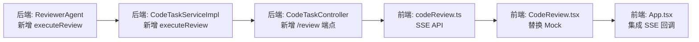

# 代码审查功能实现方案

## 1. 现状分析

### 1.1 当前代码审查实现（Mock 态）

当前代码审查功能仅存在于前端，**完全基于前端 Mock**，没有调用任何后端接口：

| 模块 | 说明 |
|------|------|
| `CodeReview.tsx` | 前端组件，包含 `generateMockReview()` 正则匹配逻辑 |
| `ReviewResult.tsx` | 展示审查结果，可复用 |
| `ReviewOutput.java` | 后端模型已存在，与前端 `ReviewOutput` 类型匹配 |
| `ReviewerAgent.java` | 后端 Agent 已存在，但仅用于生成流程中的审查环节 |

### 1.2 与代码生成的对比

| 维度 | 代码生成（已完成） | 代码审查（需改造） |
|------|-------------------|-------------------|
| **后端端点** | `POST /api/code-task/generate` → SSE | ❌ 无端点 |
| **服务层** | `CodeTaskService.executeTask()` | ❌ 无服务方法 |
| **Agent** | `PlannerAgent` / `CoderAgent` / `ReviewerAgent` | ✅ `ReviewerAgent` 存在但接口不匹配 |
| **SSE 事件流** | `phase` → `_stream` → `result` | ❌ 无事件流 |
| **前端 API** | `codeTask.ts` fetch + ReadableStream | ❌ 无 API 层 |
| **前端组件** | `RequirementInput` / `AgentFlow` / `StreamLog` / `ReviewResult` | ⚠️ 仅有 `ReviewResult` 可复用 |

---

## 2. 整体架构

```
前端                               后端
───                               ───

CodeReview.tsx                    CodeTaskController.review()
  │  POST /api/code-task/review      │
  │  { code, language }              │
  ▼                                  ▼
codeReview.ts                      CodeTaskService.executeReview()
  │  ReadableStream                  │  Flux<StreamEvent>
  │  parse SSE events                │     ├─ phase("review_parsing", ...)
  ▼                                  ▼     ├─ phase("review_analyze", ...)
App.tsx                           ReviewerAgent.executeReview()
  │  onPhase / onResult               │  llama3 → 审查结果
  ▼                                  ▼
ReviewResult.tsx                   ReviewOutput
 显示审查报告                      返回结果
```

### 2.1 数据流

```
用户提交代码
  → Frontend: POST /api/code-task/review { code, language }
  → Backend: 创建对话记录 (conversations)
  → Backend: 发出 phase 事件（逐步分析状态）
  → Backend: 调用 ReviewerAgent.executeReview()
      → LLM 分析代码 → ReviewOutput
  → Backend: 发出 result 事件（最终审查报告）
  → Frontend: 渐进渲染 phase 内容
  → Frontend: result 到达 → 展示完整报告
```

---

## 3. 后端改造

### 3.1 Controller 层 — 新增端点

**文件**: `CodeTaskController.java`

```java
@PostMapping(value = "/review", produces = MediaType.TEXT_EVENT_STREAM_VALUE)
public Flux<ServerSentEvent<Object>> review(@RequestBody CodeReviewRequest request) {
    inputFilterService.validate(request.getCode());

    Long userId = StpUtil.getLoginIdAsLong();
    log.info("用户[{}]提交代码审查请求，语言: {}", userId, request.getLanguage());

    return codeTaskService.executeReview(request.getCode(), request.getLanguage(), userId)
            .map(event -> ServerSentEvent.builder()
                    .event(event.getType())
                    .data(event)
                    .build());
}

@Data
public static class CodeReviewRequest {
    private String code;
    private String language;
}
```

### 3.2 Service 接口 — 新增方法

**文件**: `CodeTaskService.java`

```java
/**
 * 以 Flux 流式执行代码审查任务
 *
 * @param code     待审查的代码文本
 * @param language 编程语言 (java / python / typescript / ...)
 * @param userId   当前登录用户 ID
 * @return Flux 流式事件序列，前端可通过 SSE 接收
 */
Flux<StreamEvent> executeReview(String code, String language, Long userId);
```

### 3.3 Service 实现

**文件**: `CodeTaskServiceImpl.java`

```java
@Override
public Flux<StreamEvent> executeReview(String code, String language, Long userId) {
    String taskId = UUID.randomUUID().toString().substring(0, 8);
    log.info("[Review-{}] 用户[{}]开始代码审查，语言: {}", taskId, userId, language);

    // 持久化对话记录
    Conversation conversation = new Conversation();
    conversation.setConversationId(UUID.randomUUID().toString());
    conversation.setUserId(userId);
    conversation.setTitle("代码审查 - " + language);
    conversation.setRequirement("审查代码（" + language + "）");
    conversation.setStatus("ACTIVE");
    conversation.setCreatedAt(OffsetDateTime.now());
    conversation.setUpdatedAt(OffsetDateTime.now());
    conversationMapper.insert(conversation);

    return Flux.concat(
            // 阶段 1：解析代码结构
            Flux.just(StreamEvent.phase("review_parsing",
                    String.format("解析代码结构，识别语言为 %s...", language))),

            // 阶段 2：静态分析
            Flux.just(StreamEvent.phase("review_analyze",
                    String.format("代码 %d 行，%d 字符，开始运行静态分析规则...",
                            code.split("\n").length, code.length()))),

            // 阶段 3：调用 LLM 审查
            Flux.just(StreamEvent.phase("review_llm", "调用 AI 模型进行深度审查...")),

            // 执行审查
            Flux.defer(() -> {
                try {
                    ReviewOutput review = reviewerAgent.executeReview(code, language);
                    return Flux.concat(
                            Flux.just(StreamEvent.phase("review_report",
                                    "审查完成，生成审查报告...")),
                            toReviewResultEvents(review)
                    );
                } catch (Exception e) {
                    log.error("[Review-{}] 审查异常", taskId, e);
                    return Flux.just(StreamEvent.error("审查异常: " + e.getMessage()));
                }
            })
    ).doOnTerminate(() -> {
        conversation.setStatus("COMPLETED");
        conversation.setUpdatedAt(OffsetDateTime.now());
        conversationMapper.updateById(conversation);
        log.info("[Review-{}] 审查结束", taskId);
    });
}

private Flux<StreamEvent> toReviewResultEvents(ReviewOutput review) {
    List<StreamEvent> events = new ArrayList<>();

    // 发出问题数量统计
    int issueCount = review.getIssues() != null ? review.getIssues().size() : 0;
    int hallucinationCount = review.getHallucinationIssues() != null
            ? review.getHallucinationIssues().size() : 0;
    events.add(StreamEvent.phase("review_summary",
            String.format("发现 %d 个问题（其中 %d 个潜在幻觉），评分: %d/100",
                    issueCount, hallucinationCount, review.getScore())));

    // 发出最终结果
    Map<String, Object> resultData = new LinkedHashMap<>();
    resultData.put("review", review);
    events.add(StreamEvent.result(resultData));

    return Flux.fromIterable(events);
}
```

### 3.4 ReviewerAgent — 新增独立审查方法

**文件**: `ReviewerAgent.java`

当前 `execute()` 方法需要 `CoderOutput` 参数，这是因为该 Agent 在生成流程中要审查 Coder 的输出。审查场景不需要 CoderOutput，需要新增一个独立方法：

```java
/**
 * 代码审查全新独立方法（非生成流程中的审查）
 * 接收原始代码文本，绕过 CoderOutput 结构
 */
public ReviewOutput executeReview(String code, String language) {
    String format = outputConverter.getFormat();

    // 构建审查专用 Prompt —— 不需要需求描述、文件列表、依赖声明
    String userContent = String.format("""
            请审查以下 %s 代码：

            ```%s
            %s
            ```

            请从以下维度进行审查：
            1. 语法正确性 — 是否存在语法错误
            2. API 真实性 — 使用的类、方法、框架是否真实存在
            3. 安全性 — 是否存在安全漏洞（SQL注入、XSS等）
            4. 最佳实践 — 是否符合 %s 语言的惯用写法
            5. 性能 — 是否存在性能问题

            输出必须严格匹配以下 JSON Schema 格式：
            %s
            """, language, language, code, language, format);

    Prompt prompt = new Prompt(List.of(
            new SystemMessage("你是一个多编程语言代码审查专家。" +
                    "专注于发现代码中的语法错误、API幻觉、安全漏洞和性能问题。" +
                    "输出必须为合法的 JSON 格式。"),
            new UserMessage(userContent)
    ));

    log.info("[ReviewerAgent] 开始独立审查代码（语言: {}）...", language);

    ChatResponse response = chatModel.call(prompt);
    String content = response.getResult().getOutput().getText();

    ReviewOutput output = null;
    if (content != null) {
        output = outputConverter.convert(content);
    }

    log.info("[ReviewerAgent] 审查完成: accepted={}, score={}",
            output != null ? output.isAccepted() : false,
            output != null ? output.getScore() : 0);

    return output;
}
```

---

## 4. 前端改造

### 4.1 SSE 流式 API

**文件**: `src/api/codeReview.ts`

```typescript
import type {
  SSEPhaseEvent, SSEResultEvent, SSEErrorEvent, SSEEventName,
} from '../types';

export type ReviewSSECallback = {
  onPhase?: (data: SSEPhaseEvent) => void;
  onResult?: (data: SSEResultEvent) => void;
  onError?: (data: SSEErrorEvent) => void;
};

function getAuthHeaders(): Record<string, string> {
  const headers: Record<string, string> = { 'Content-Type': 'application/json' };
  const token = localStorage.getItem('auth_token');
  if (token) {
    headers['rj-token'] = token;
  }
  return headers;
}

function handleUnauthorized() {
  localStorage.removeItem('auth_token');
  localStorage.removeItem('auth_user');
  window.dispatchEvent(new CustomEvent('auth:unauthorized'));
}

export function submitCodeReview(
  code: string,
  language: string,
  callbacks: ReviewSSECallback,
): AbortController {
  const controller = new AbortController();

  fetch('/api/code-task/review', {
    method: 'POST',
    headers: getAuthHeaders(),
    body: JSON.stringify({ code, language }),
    signal: controller.signal,
  })
    .then(async (response) => {
      if (response.status === 401) {
        handleUnauthorized();
        callbacks.onError?.({ type: 'error', phase: 'end', content: '登录已过期' });
        return;
      }
      if (!response.ok) {
        callbacks.onError?.({ type: 'error', phase: 'end', content: `请求失败: ${response.status}` });
        return;
      }

      const reader = response.body?.getReader();
      if (!reader) {
        callbacks.onError?.({ type: 'error', phase: 'end', content: '响应流不可用' });
        return;
      }

      const decoder = new TextDecoder();
      let buffer = '';

      while (true) {
        const { done, value } = await reader.read();
        if (done) break;

        buffer += decoder.decode(value, { stream: true });
        const parts = buffer.split('\n\n');
        buffer = parts.pop() ?? '';

        for (const part of parts) {
          const event = parseSSEEvent(part);
          if (event) {
            const { eventName, data } = event;
            dispatchEvent(eventName, data, callbacks);
          }
          await new Promise<void>(resolve => setTimeout(resolve, 0));
        }
      }
    })
    .catch((err) => {
      if (err.name !== 'AbortError') {
        callbacks.onError?.({ type: 'error', phase: 'end', content: `连接异常: ${err.message}` });
      }
    });

  return controller;
}

function parseSSEEvent(chunk: string): { eventName: SSEEventName; data: string } | null {
  const lines = chunk.split('\n');
  let eventName: SSEEventName | null = null;
  let data = '';

  for (const line of lines) {
    if (line.startsWith('event:')) eventName = line.slice(6).trim() as SSEEventName;
    else if (line.startsWith('data:')) data = line.slice(5).trim();
  }

  return eventName && data ? { eventName, data } : null;
}

function dispatchEvent(
  eventName: SSEEventName,
  rawData: string,
  callbacks: ReviewSSECallback,
) {
  try {
    const data = JSON.parse(rawData);

    switch (eventName) {
      case 'phase':
        callbacks.onPhase?.(data as SSEPhaseEvent);
        break;
      case 'result':
        callbacks.onResult?.(data as SSEResultEvent);
        break;
      case 'error':
        callbacks.onError?.(data as SSEErrorEvent);
        break;
    }
  } catch {
    // 忽略解析失败
  }
}
```

### 4.2 改造 CodeReview 组件

**文件**: `CodeReview.tsx`

去除 mock 逻辑，改为调用真实 API：

```typescript
interface Props {
  onStart: () => void;
  onPhase: (phase: string, content: string) => void;
  onResult: (review: ReviewOutput) => void;
  onError: (msg: string) => void;
  running: boolean;
}
```

- 用户点击「开始审查」→ 调用 `submitCodeReview(code, language, callbacks)`
- `onPhase` 回调 → 累积流式内容（类似 `streamingContent` 模式）或追加到日志
- `onResult` 回调 → 设置 `reviewReport`，右侧面板显示 `ReviewResult`
- `onError` 回调 → 显示错误信息

### 4.3 App.tsx 集成

参考 `handleGenSubmit` 的 SSE 事件处理模式：

```typescript
const [reviewStatus, setReviewStatus] = useState<TaskStatus>('idle');
const [reviewPhases, setReviewPhases] = useState<string[]>([]);
const [reviewReport, setReviewReport] = useState<ReviewOutput | null>(null);

const handleReviewSubmit = useCallback((code: string, language: string) => {
  setReviewStatus('running');
  setReviewPhases([]);
  setReviewReport(null);

  const abort = submitCodeReview(code, language, {
    onPhase: (data) => {
      setReviewPhases(prev => [...prev, data.content]);
      // 也可追加到 stream log
    },
    onResult: (data) => {
      if (data.data?.review) {
        setReviewReport(data.data.review);
      }
      setReviewStatus('completed');
    },
    onError: (data) => {
      setReviewStatus('error');
    },
  });
}, []);
```

### 4.4 右面板展示

复用现有 `ReviewResult` 组件，流式内容在中心面板日志中展示，最终报告在右面板：

```tsx
{reviewReport && (
  <div className="right-section">
    <ReviewResult review={reviewReport} />
  </div>
)}
```

---

## 5. 与代码生成的差异分析

| 方面 | 代码生成 | 代码审查 |
|------|---------|---------|
| **Agent 数量** | 3 个（Planner + Coder + Reviewer） | 1 个（Reviewer 独立审查） |
| **StateGraph** | 需要有向图编排（含条件路由、重试） | 不需要 Graph，单 Agent 直调即可 |
| **会话记录** | 创建对话 + 持久化 UserMessage | 创建对话 + 持久化审查结果 |
| **SSE 事件** | 按节点划分 + `_stream` 子事件 | 按审查步骤划分即可 |
| **输入** | 需求文本 | 代码文本 + 语言类型 |
| **输出** | `{plan, code, review}` 三件套 | `{review}` 单结果 |
| **前向状态** | `AgentFlow` 展示 3 节点流转 | 简单日志展示分析步骤即可 |

**结论**：代码审查的实现比代码生成简单：
- 后端不需要 StateGraph 编排
- ReviewerAgent 只需一个独立方法
- 前端只需要 SSE 流 + 日志 + 结果展示

---

## 6. 事件类型定义（SSE Type 扩展）

在 `StreamEvent.java` 的 `type` 枚举中扩展审查相关阶段（当前 `type` 为字符串，可直接使用新值）：

| phase 值 | 说明 |
|----------|------|
| `review_parsing` | 解析代码结构 |
| `review_analyze` | 运行静态分析规则 |
| `review_llm` | LLM 深度审查 |
| `review_report` | 生成审查报告 |
| `review_summary` | 审查结果摘要 |

这些 phase 的前端处理与代码生成的 `_stream` 事件类似，按阶段累加内容并渐进渲染。

---

## 7. 实施步骤



### Step 1: ReviewerAgent.executeReview()
- 新增独立审查方法，接受 `(code, language)` 参数
- 构建审查专用的 SystemPrompt + UserPrompt
- 调用 `chatModel.call(prompt)` 获取结果
- 返回 `ReviewOutput`

### Step 2: CodeTaskServiceImpl.executeReview()
- 创建对话记录
- 编排 review 阶段事件（parsing → analyze → llm → report）
- 调用 ReviewerAgent
- 发出 result 事件

### Step 3: CodeTaskController 新增端点
- `POST /api/code-task/review`
- 输入过滤 → 获取用户 → 调用服务 → SSE 输出

### Step 4: 前端 codeReview.ts
- 参考 `codeTask.ts` 实现 SSE 流式读取
- 复用相同的事件解析逻辑（parseSSEEvent、dispatchEvent）

### Step 5: 改造 CodeReview.tsx
- 移除 `generateMockReview()`
- 移除 MockStep 模拟流程
- 接入真实 API 调用

### Step 6: App.tsx 集成
- 添加 `reviewStatus`、`reviewPhases`、`reviewReport` 状态
- SSE 事件回调处理（与 handleGenSubmit 模式一致）
- 右面板展示 ReviewResult
